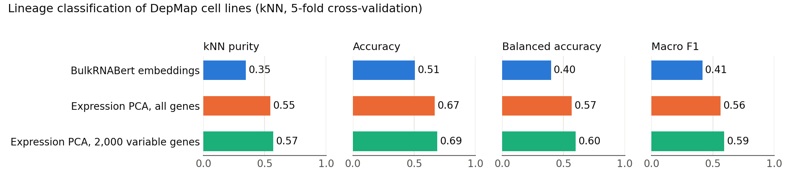
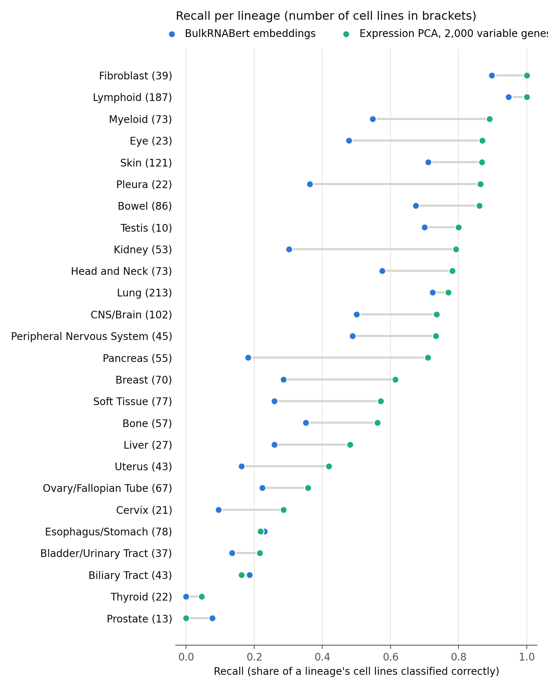
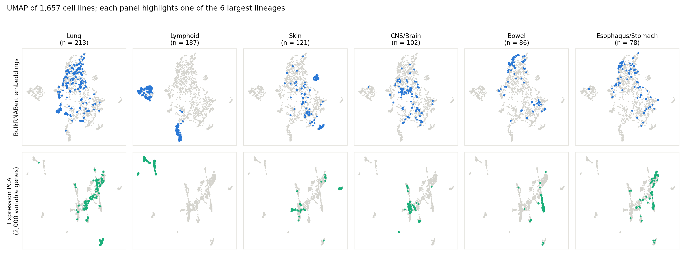

# depmap-bulkrnabert

A reproducible pipeline to extract **BulkRNABert** embeddings from DepMap bulk RNA-seq data and test whether they preserve tissue lineage better than standard expression baselines.

Model source: [instadeepai/multiomics-open-research](https://github.com/instadeepai/multiomics-open-research)

## Question

Do embeddings from a pretrained gene-expression foundation model (BulkRNABert, TCGA checkpoint) capture the tissue lineage of DepMap cancer cell lines, and how do they compare with simple baselines such as PCA on gene expression?

## Result

Standard expression PCA outperformed the pretrained embeddings on every metric.

| Representation | kNN purity | Accuracy | Balanced accuracy | Macro F1 |
|---|---|---|---|---|
| BulkRNABert embeddings (256 dimensions) | 0.346 | 0.507 | 0.398 | 0.415 |
| PCA (20 components), all genes | 0.546 | 0.667 | 0.567 | 0.564 |
| PCA (20 components), 2,000 most variable genes | **0.569** | **0.688** | **0.600** | **0.593** |

Setup: 1,657 cell lines from 26 lineages (`OncotreeLineage`, lineages with at least 10 cell lines), kNN classifier with k = 10 and cosine distance, 5-fold stratified cross-validation.

### Where the embeddings work and where they fail

The gap is not uniform across lineages. Recall per lineage (the share of a lineage's cell lines that are classified correctly) shows three groups:

- **Embeddings close to the baseline.** Lymphoid (0.95 vs 1.00), fibroblast (0.90 vs 1.00) and lung (0.72 vs 0.77). A plausible reason is that these lineages differ from the rest in broad expression programmes, which survive mean pooling.
- **Embeddings far behind.** Pancreas (0.18 vs 0.71), pleura (0.36 vs 0.86), kidney (0.30 vs 0.79), eye (0.48 vs 0.87) and myeloid (0.55 vs 0.89). Expression PCA separates these lineages well, so the signal is in the data but is lost in the embedding.
- **Hard for both.** Esophagus/stomach, biliary tract, bladder, thyroid, cervix and prostate stay below 0.30 with either method. Most are carcinomas, which are probably difficult to tell apart from bulk expression with a simple kNN classifier.

Expression PCA is better in 23 of 26 lineages. In the other three the embeddings lead by at most 0.08, which is one or two cell lines.

The UMAP below shows the six largest lineages in the embedding space (top row) and in expression space (bottom row).

Full tables: [`results/metrics_summary.csv`](results/metrics_summary.csv) and [`results/per_lineage_recall.csv`](results/per_lineage_recall.csv).

## Pipeline

| Step | Script | Output |
|---|---|---|
| 1. Preprocessing | `scripts/depmap_preprocessing.py` | `depmap_ensembl_aligned.npy` |
| 2. Embedding extraction | `scripts/extract_embeddings_depmap.py` | `embeddings.npy` (samples × 256) |
| 3. Evaluation | `scripts/step3_4_downstream_depmap.py` | summary metrics and exploratory plots |
| 4. Figures and per-lineage results | `scripts/make_figures.py` | `figures/` and `results/` |

### 1. Preprocessing

Inputs:

- `OmicsExpressionProteinCodingGenesTPMLogp1.csv` (DepMap)
- NCBI `gene2ensembl` mapping file
- `common_gene_id.txt` from BulkRNABert

Steps:

- Extract Entrez IDs from the DepMap gene headers and map them to human Ensembl IDs.
- Average duplicate Ensembl IDs.
- Reorder genes to match the model's fixed list of 19,062 genes, zero-filling genes missing from DepMap.
- Check shapes and missing values, and plot the global TPM distribution and housekeeping gene expression.

### 2. Embedding extraction

- Pretrained BulkRNABert (`bulk_rna_bert_tcga` checkpoint), loaded through the official API. No fine-tuning.
- DepMap values are converted from log2(TPM+1) to log10(TPM+1), the scale the model expects.
- Token embeddings from layer 4 are mean-pooled across genes to give one 256-dimensional vector per cell line.
- Inference runs on CPU in batches, reading the input and writing the output as memory-mapped arrays to keep memory use low.

### 3. Evaluation

- kNN purity: the fraction of each cell line's 10 nearest neighbours that share its lineage.
- Cross-validated kNN lineage classification: accuracy, balanced accuracy and macro F1.
- Recall per lineage, from the same cross-validated predictions.
- UMAP of the embeddings and of the expression baseline.

## Running it

BulkRNABert needs Python 3.11 with specific versions of JAX and dm-haiku, so the pipeline runs inside an Apptainer/Singularity container.

1. Build the container from `container/bulkrnabert.def`.
2. Edit the paths at the top of each script and SLURM file to point to your data.
3. Run the preprocessing script, then submit `scripts/run_inference.sbatch` and `run_downstream.sbatch` with `sbatch`.
4. Submit `run_figures.sbatch` to create the figures and result tables. `scripts/make_figures.py` finds its input files under the folder given with `--base`, so it needs no path edits.

## Interpretation

Three factors probably explain the weaker lineage signal in the embeddings:

- **Mean pooling.** Averaging over all 19,062 gene tokens weights every gene equally, so the few marker genes that define a tissue are diluted by housekeeping genes. This is how the model's embeddings are meant to be extracted, so it is a limit of the design, not an error in the pipeline.
- **Domain shift.** The model was trained on TCGA tumours, whereas DepMap contains cell lines grown in vitro.
- **A strong baseline.** Tissue identity is strongly encoded in raw expression and often driven by a small number of marker genes, which PCA on variable genes captures directly.

## Lessons from preprocessing

- **Gene identifiers.** Most of the work was harmonising Entrez and Ensembl IDs. Small mismatches break compatibility with the model without raising an error.
- **Silent failures.** Wrong gene order runs without errors but invalidates the result, so explicit checks on shape, missing values and distributions are essential.
- **Zero-filling is an assumption.** A zero can mean "not expressed" or "not measured", and that choice affects interpretation.

## Limitations and next steps

- Only one pooling strategy (mean) and one layer (4) were tested.
- Lineage classification is a single task; the embeddings may do better on others, such as predicting gene dependency or drug response.
- Next: compare with other models (for example Flexynesis) and with fine-tuned embeddings.
